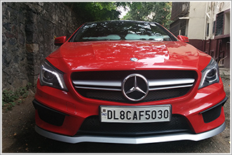

# CNN Visualization for Your Own Project
- CNN을 이용한 자동차 번호판 인식 모델을 이용한 CNN을 Visualization 

### 모델 구조

### Predicting the output

### Visualization
- 기존 이미지

- Visualization한 결과

### 참고 사이트
- https://www.kaggle.com/sarthakvajpayee/license-plate-recognition-using-cnn/data?select=indian_license_plate.xml
